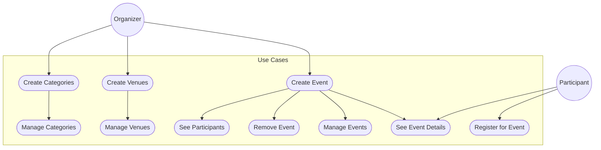
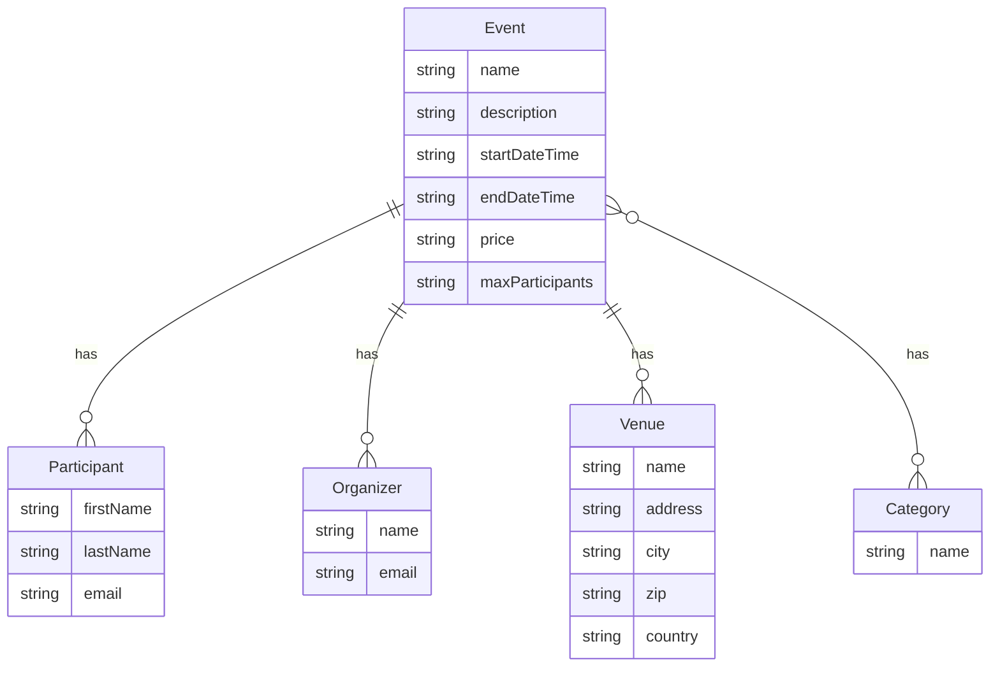

# Prototyping Mini-Project

This repository holds my individual project work for the course "Prototyping"
in the bachelor's degree programme "Business Information Technologies" at
Zurich School of Applied Sciences (ZHAW).

## Project Description

This project is about creating a web based application (prototype) for an
event management system. The application is intended to be used by event
organizers to manage their events and by event participants to register for
events.

## Use Cases

## Entity Relationship Diagram

