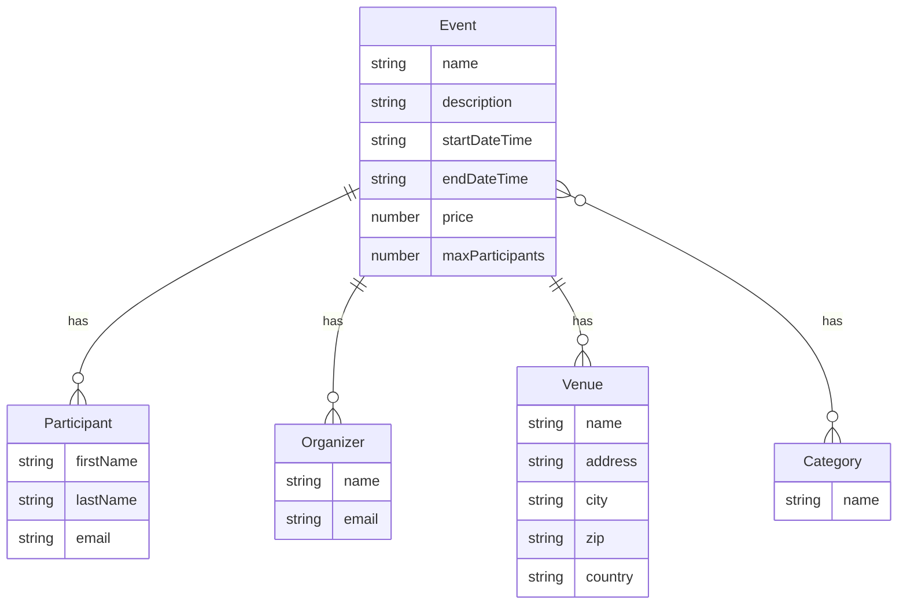

# Prototyping Mini-Project

This repository holds my individual project work for the course "Prototyping"
in the bachelor's degree programme "Business Information Technologies" at
Zurich School of Applied Sciences (ZHAW).

## Project Description

This project is about creating a web based application (prototype) for an
event management system. The application is intended to be used by event
organizers to manage their events and by event participants to register for
events.

## Use Cases

## Entity Relationship Diagram

## Requirements

- [x] HTML
  - [x] Content and structure
  - [x] min. 1 image and/or other media
- [x] CSS/Bootstrap
  - [x] CSS and/or Bootstrap layout
  - [x] Use of Bootstrap components
  - [x] CSS for customization
- [x] Webapp
  - [x] Webapp
    - [x] Use of JavaScript
    - [x] Use of Svelte for variable data
    - [x] Working (no errors)
    - [x] Use of Svelte for dynamic content
  - [ ] Content
    - [x] Pages for at least 2 entity types (min. 1 m:n relation)
    - [ ] Min. 1 page containing a form to create or edit an entity
    - [x] Min. 1 page showing details of an entity
  - [x] Navigation
    - [x] Working navigation
    - [x] Use of a routing library
  - [x] Components
    - [x] Min. 5 Svelte components
- [x] HTTP, Server, DB
  - [x] HTTP
    - [x] Min. 4 different HTTP requests
    - [x] Min. 1 POST request
  - [x] Server backend
  - [x] Database (MongoDB)
- [x] Extensions
  - [x] Use of advanced Svelte features
    - [x] Stores
    - [x] Transitions
    - [x] Slots, named slots and slot fallbacks
    - [x] Special elements
    - [x] Module context
  - [x] Use of additional libraries
    - [x] `@mdi/js`
    - [x] `date-picker-svelte`
  - [x] Extended content
    - [x] Multiple pages for entity types
      - [x] Events (`/events`)
      - [x] Venues (`/venues`)
      - [x] Categories (listed on `/events`)
      - [x] Users (listed on `/login`)
    - [ ] Multiple pages containing a form to create or edit an entity
      - [ ] Events (`/events/new` and `/events/[id]/edit`)
      - [ ] Venues (`/venues/new` and `/venues/[id]/edit`)
      - [ ] Categories (`/events/[id]/edit`)
    - [x] Multiple pages showing details of an entity
      - [x] Event details (`/events/[id]`)
      - [x] Venue details (`/venues/[id]`)
  - [x] _Own idea_: Use of advanced CSS features
    - [x] Variables
    - [x] `calc()`
    - [x] `::before` and/or `::after`
  - [x] _Own idea_: User and session management
    - [x] User switching
    - [x] Session persistence (cookies)
    - [x] User roles and authorization (e.g. only organizer can edit events)
  - [x] _Own idea_: Multiple themes
    - [x] Light and dark theme
    - [ ] Theme switcher
    - [x] Default theme based on system theme
  - [x] _Own idea_: Filtering
    - [x] Filtering events by category
  - [x] _Own idea_: Advanced routing
    - [x] URL parameters
      - [x] Path parameters
      - [x] Query parameters
    - [x] Error pages
